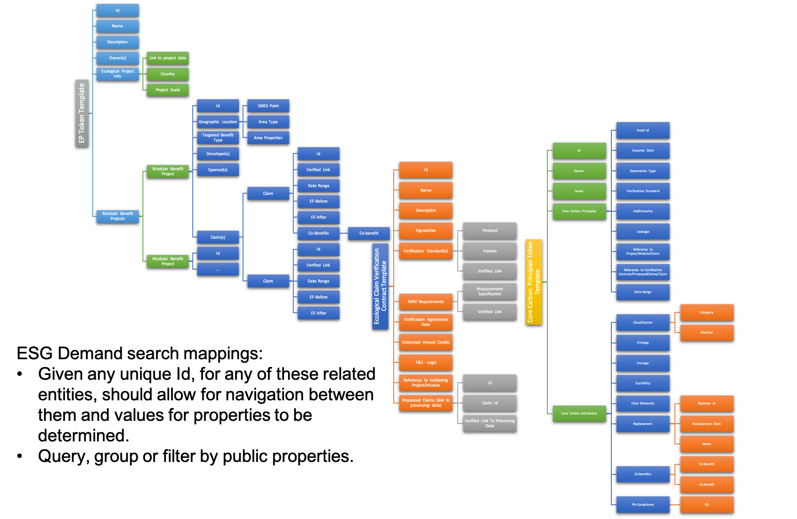

# GHG Offsets Analytics

Analytics use cases include areas where participants in the voluntary market will like to find information about emissions, carbon credits to purchase or historical activity.

## Voluntary Buyer Use Cases

As a voluntary market can offer both standardized carbon credits like a commodity, a.k.a. a standard reference contract that is fungible with other credits in the same class, or can be non-fungible custom contracts that can differ in value and also be bundled together based on their Core Carbon Attributes, an implementation should have searchable parameters.

Using the specifications for [Ecological Projects](../credits/ecological-project.md), [Core Carbon Principle Credits](../credits/ccp.md) and [Verification Contracts](../credits/verification.md), buyers should be able build queries to find products based on their buyer preferences.

