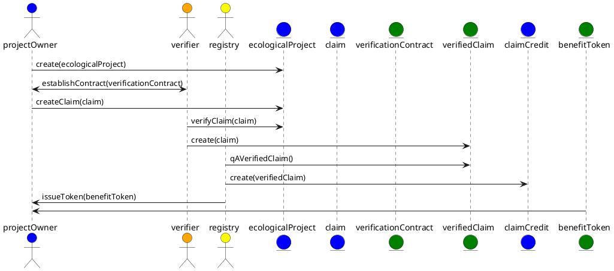

# Ecological Project or Program (EP)

Ecological Projects or Programs provide a single source of truth to all participants regarding the identity of a project/program and its ecological benefit claims. It is important to have this source of truth for all participants to be able to trace the source of a ecological benefit tokens back to its source project. Here key details about the project/program are recorded that are important for the supplier, verifier, registry and buyer in the market. 

What is the difference between a Project or a Program?

- Project: is typically used to describe an nature based projects like agricultural (farms) or forestry.
- Program: is typically used to describe a technology based solution like direct air capture or carbon capture during natural gas extraction or processing.

Every Ecological Project/Program will have the following:

- Unique identifier (Id): that is issued and independent of the "name" of the project. The Id is used to reference the project and link it to its claims, verification and credits issued to it.
- Name: A name, recommended, but not required, to be unique.
- Description: a brief description of the project.
- Owner(s): have Id(s) of one or more owner accounts.
- Ecological Project Info: this is meta data, defined below, about the project.
- Modular Benefit Projects (MBP): a project has one or more MBPs based on the type of claim that the project will be making. For example, a project can make both carbon reduction and removal claims and would need a MBP for each type of claim it will make.

Ecological Project Info contains:

- A verified link to more project data, i.e. marketing materials like a website.
- Country: the host country for the project.
- Project Scale: one from the list of - Micro, Small, Medium or Large

Modular Benefit Project contains:

- Unique identifier (Id): that is issued and independent of the the project. The Id is used to establish a compound identifier linking the MBP with it's host ecological project.
- Geographic Location:
  - Basic GNS/GPS for Programs
  - GeoJSON for Projects
- Targeted Benefit Type:
  - Carbon: Reduction/Removal + Natural/Technology
  - Water:
  - Nitrogen:
- Developer(s)
- Sponsor(s)
- Claims

Claim contains:

- Unique identifier (Id): that is issued and independent of the the MBP. The Id is used to establish a compound identifier linking the claim with its MBP and ecological project.
- Verified Link: to the source data the claim is based off of. This contains a [URI](https://en.wikipedia.org/wiki/Uniform_Resource_Identifier) of the data file that contains the data to be verified and either a digital signature or hash of the data file so that its integrity can be checked at anytime by comparing the data file against its verified signature or hash.
- Date Range: the date span that the claim is being made for.
- Environmental Effects Before: a measure of the claim before project activities.
- Environmental Effects After: a measure of the claim after project activities.
- Co-benefits: one or more from a list of the added benefits we get when we act to control climate change, above and beyond the direct benefits of a more stable climate.

**The complete draft of the TTF specification, including its token base and behaviors, for the [Ecological Project](https://github.com/InterWorkAlliance/TTF/tree/master/artifacts/token-templates/specifications/Ecological-Project/latest).**

## Basic flow for establishing a project and issuing offsets

Here are the high-level, "greenfield", steps for establishing an ecological project and having CCPs issued for it.

- An ecological project owner defines their project and determines the type of benefit claims that they will be making. Claims should be based off of a scientific standard established by a registry that matches the activity the project will be conducting.
- The project owner will need to contract with a certified verifier for the standard they are submitting claims for. Once contracted, the project owner can submit the claim, which is comprised of the data required by the standard for the time period the claim is for and a claim receipt, which is the claim entry in the Modular Benefit Project.
- The contracted verifier then conducts its verification process based in the standard being used for the claim. The verified amount of the claim, a carbon reduction or removal, by the project becomes the verified claim, that consists of the marked up claim data and verification report along with a receipt for the verified claim that is the verified claim entry on the verification contract.
- A verified claim is then picked up by the registry of the standard used for the claim and after a quality check, the registry creates a credit in the amount verified by the claim. This becomes the carbon credit. Once the credit is established in the registry, the credit is "tokenized" in an intangible reference token, generically referred to as an Ecological Benefit Token, but is tokenized as a specific type like a Core Carbon Principles token. On the registry and ledger where the token is implemented, the owner of the credit is the ecological project owner.

