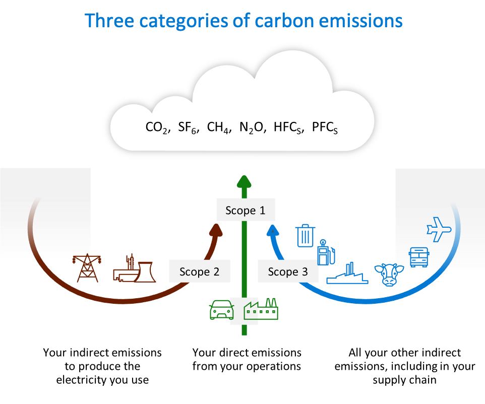

# Carbon Emissions Token (CET)

Reporting GHG/Carbon emissions following the GHG Protocol follows a standardized accounting methodology for calculating the actual emissions an organization directly and indirectly emits.

The CET represents a specified volume of metric tons of greenhouse gas (GHG) emissions and should be able to distinguish [GHG Protocol (GGP)](https://ghgprotocol.org) Scope and Category of the emissions reported.

In order to understand how carbon is spread across a supply chain and to effectively begin targeting reductions where they are the largest, it is important to be able track and trace the emissions across the entire supply chain. The GGP does this by scoping and categories of emissions.

At a high level, one participant's scope 1 emissions, become another participants scope 2 for direct energy consumption. Scope 3 emissions flow upstream and need to be calculated, which is complex process that involves estimations at best with a bit of guess work thrown in. If full track and trace for scope 1 & 2 emissions can be capture by enough participants in a supply chain, it should be able to be overladed with trade flows between the supply chain to more be a more straight forward and accurate calculation.

One additional aspect for CETs, is their offsetting with [CCPs](../offsets/ccp.md) and allowing that offset to cascade through the emissions reporting within a supply chain. Where any implementation of offsets should ensure that an offset cannot be spent or applied twice for scope 1 emissions, it DOES want to ensure that any offset that decreases a downstream participant's emissions also decreases proportionately for the upstream consumers calculating their scope 3 emissions.

Using both a CET to account for emissions and a COT to account for an offset/reduction allows for this behavior in any implementation.

**There is a [DRAFT TTF CET Specification](https://github.com/interworkalliance/TokenTaxonomyFramework/blob/master/artifacts/token-templates/specifications/CET/latest/CET-spec.pdf) serving largely as a placeholder to review and discussion. It is intentionally incomplete.**
