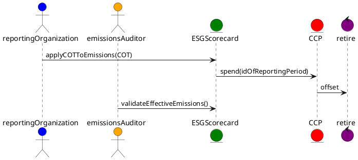
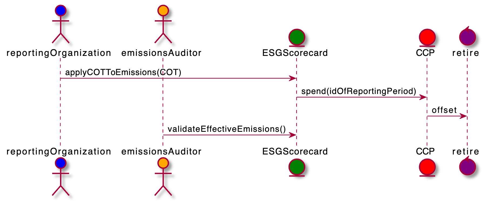

# Lifecycle - Offsetting Emissions to determine effective emissions

Participants can purchase carbon offsets and apply them against their reported period actual emissions in order to achieve their goal for the period. When an offset is applied to reduce actual emissions, the offset is spent and cannot be reused or sold and generates a lower effective emissions balance.

Core Carbon Principle tokens (CCP) represent credits that can be used to offset or decrease (netting) a reporting organization's effective emissions for the reporting period. Effective balances for a period can be calculated from the ledger based on the actual CET transferred or issued in the period for the organization minus the COTs it spends in the period.

Once track and trace capabilities are realized the applied offsets should cascade in the supply chain and be reflected upstream in a reduction of Scope 3 reported emissions.