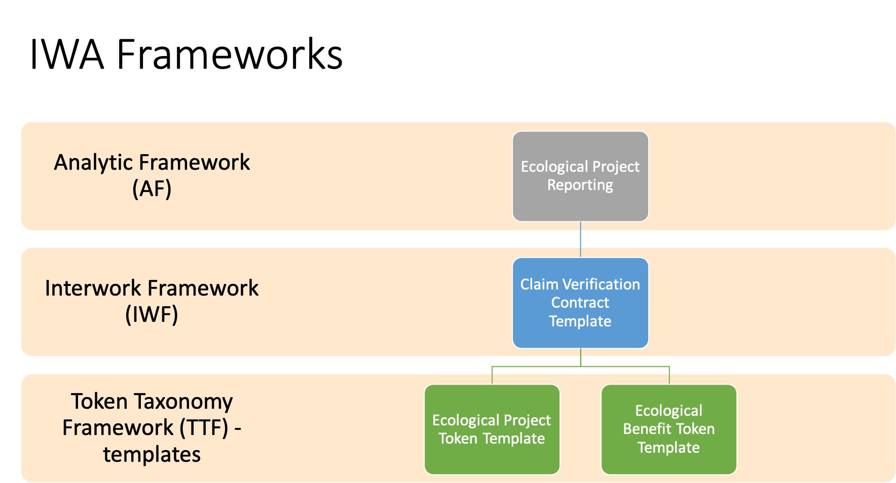

# Voluntary Ecological Markets Taskforce

## Overview

The goal of the Voluntary Ecological Markets Taskforce (VEM) is to establish the standards for tokenization, contractual extensions, workflows, and analytics for establishing a standards based ecological market. These standards will serve as foundations for using distributed ledger techniques to create an auditable ecosystem. The taskforce choose to use a broad definition of ecology rather than just carbon as the same techniques and instruments defined for carbon can repurposed for other ecological benefit types like water, etc. However, the voluntary carbon market is the most advanced, relatively speaking, so it will be used as the canonical example in the VEM.

Essential to any market are buyers and sellers as well as a method of finding or matching them together, negotiation of exchange and ultimately the exchange of value between them. In the "carbon" markets, there are, in general, two major types of markets, voluntary and regulated. Where the voluntary markets are not under any agency of regulatory control or sanction, meaning participants are active based on natural market forces or social responsibility to be consumers in the market. For example, [environmental, social and governance (ESG) criteria](https://www.investopedia.com/terms/e/environmental-social-and-governance-esg-criteria.asp) being defined by socially conscious investors used to screen potential investments based on company operations. As opposed to regulated markets require governmental agency, either a nation state or treaty like Kyoto or Paris accords that require industry compliance as participants.

In short, carbon credits provide a key driver and incentive for any organization committing to a sustainability plan. They enable a company the means to cost-effectively offset its own carbon dioxide emissions while giving a company the needed time to prioritize and allocate resources and capital into longer-term direct emissions reductions achieved by cleaner technologies, fuels, and supply chains. Purchasing credits allow companies to invest in climate action, claim the achievement of near-term goals, and to sell any surplus credits they do not consume to organizations that do not have enough credit to cover their own emissions.

There are generally two types of carbon credits: emission allowances and carbon offsets. Emission allowances are creatures of government regulation that issue permits to emit one ton of carbon-equivalent (identified as CO2e) greenhouse gases. Permits are either allocated or auctioned to regulated entities, subject to a permitted cap – meaning that the regulated entity has to purchase allowances if its actual emissions exceed its allocation. If the original owner’s actual emissions are below its allowance allocation, it can sell the surplus to other entities.

A carbon offset is an intangible asset that is created by project owners. An offset is minted when it becomes issued in an environmental registry, something that happens upon verification that one ton of CO2e greenhouse gases have either been avoided (e.g. clean electricity), reduced (e.g. sustainable fuels), or sequestered (e.g. avoided deforestation, sustainable farming) by an approved project or activity. That offset represents the original owner’s property right claims to those carbon-related benefits. The owners can then sell their credits directly to buyers or at wholesale. The ultimate end-user has the right to claim the benefits and an ability to retire the credit permanently – usually as part of netting the claimed CO2e benefits against that end-users other GHG emissions.

In the VEM, we will be collecting the requirements from the subject matter experts from emissions, credit offsets and market infrastructure based on historical experiences and the new possibilities made available when applying multi-party techniques and technology like distributed ledgers.

## Requirements

Below are a list of high level business requirements for the major aspects of carbon markets.

### Roles

A list of [Roles](roles.md) that participants in a voluntary ecological market can play.

### Emissions and Reporting

Most organizations participating in the voluntary market are setting goals and reporting their carbon emissions.

Initially, the VEM will not attempt to define a level of detailed carbon accounting, but rather gather a coarse recording of Scope 1, 2 and 3 emission goals, actual and netting of owned credits to offset resulting in effective emissions to track progress for participants in the voluntary market.

[Emissions](emissions/readme.md)

### Verified Supply - Credits

Here standard representations of value for either a ecological product or the source of these products are defined:

- Establish a standard token or digital asset representation for GHG/Carbon Credits, linked to the removal project and verifying organization.
- Collaborate with other initiatives like the [TSVCM](https://www.iif.com/tsvcm) to align terminology and recommendations with token and contract definitions produced using the IWA tools.
- Provide specifications that represent the shared set of data required by market participants allowing for credit comparison and rapid quality determination for increasing confidence in the market.
- Record and link removal project and tokens to the removal technique and accounting methodology to enable quality grading of offsets based on aspects like geography, sequestration type, scientific measurement, etc.
- Prevent the double crediting or spending of credits by removal projects or emissions reporters.

[Verified Supply -Credits](credits/readme.md)

### Market Contracts and Infrastructure

Participants in the voluntary market will want to list, trade, offset, etc. these ecological projects and have a common understanding of the rules that the market will set.

- Establish standardize contracts for applying or spending credits by emissions reporters retiring them so they cannot be applied again or resold once consumed.
- Establish standard reference contracts, spot, forward and futures for either OTC or exchange based trades.

[Market Contracts](contracts/readme.md)

### Market Analytics

Once a market is established, it is helpful to have standard ways of making sense of the larger ecosystem by identifying key attributes to be available for building custom searches or to build knowledge bases.

[Market Analytics](analytics/readme.md)

## Exploring Focus Categories

The VEM breaks out work into categories where subject matter experts can focus and contribute to the background, terms and definitions and specification development.

[Emissions](emissions) - where [Greenhouse Gas Protocol](https://ghgprotocol.org) accounting results are tokenized with the appropriate behaviors, property sets and contract relationships are established. This includes key data attributes that could unlock analytical scenarios possible in the future. Initially, emissions will focus on higher level emissions and goal setting aligning with initiatives like the [SBTi](https://sciencebasedtargets.org).

[Credits](credits) - where accounting results for GHG/Carbon reduction projects and emission allowances are tokenized with the appropriate behaviors, property sets and contract relationships are established. This includes key data attributes that could unlock analytical scenarios possible in the future.

[Contracts](contracts) - where contract and workflows for parties working with both emissions and credit tokens are established.

[Roles](roles.md) - where voluntary market participant roles are defined and described.

[Analytics](analytics/readme.md)

## Standards

The VEM will generate its token, interwork and analytic standards using the IWA frameworks and can be found in the framework libraries.

## Scenario

The basics of the VEM are to define the participants, tokens, contracts and shared data involved in the voluntary carbon ecosystem. We will break out into categories, emissions (demand/buyer) and offsets (supply/sell). These categories become connected in a marketplace where voluntary reporting organizations can record their emission goals and actual results and locate carbon credit suppliers to purchase and apply to actual emissions in order to reach an effective emission result that matches their goal.

The use of tokenized/digital asset representations of both GHG/Carbon emissions as well as offset/reductions that are "aware" and "interact" with one another via complete lifecycle track and trace and unlock efficiencies in the accounting, reporting and intelligence in carbon markets.

## High-level Details

Both the [emissions](emissions) and [credits](credits) folders contain working documents for discussion and providing background for the tokenization of a [Carbon Emission Token](emissions/cet.md) and a [Core Carbon Principle Credit](credits/ccp.md). These tokens will represent the minimally viable shared data required for the multi-party scenarios for buyers, sellers and investors in these digital assets.  These tokens will be related to "contracts" like emissions reporting and goal pledges, carbon removal projects and other entities defined in the [Contracts](contracts) folder.

