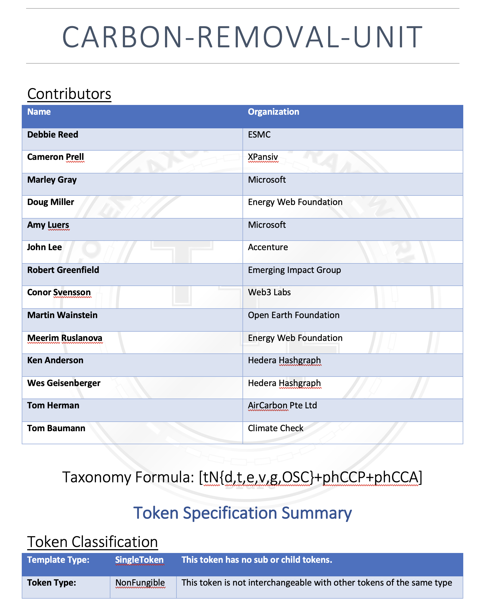

# Carbon Removal Unit (CRU) Token

A Carbon Removal Unit is very similar to the Core Carbon Principles (CCP) token regarding properties, but differs in that it is a non-fungible token (NFT). It represents 1 metric tons of GHG emissions removed by a project or program. The technique for removal, its measurement and verification methodology is found in the Verification Contract and the issuing standard registry. The CRU is a tradeable digital asset which the market determines price using the associated information found in the related entities on the network.

The CRU has standard data elements the represent the shared view required by the parties in the carbon market from suppliers, buyers, verifiers, registries and exchanges and are based off of the recommendations from the [TSVCM](https://www.iif.com/tsvcm).

CRUs have the following behaviors and properties:

- A non-fungible token (NFT) that represents 1 Carbon Removal Unit or CRU, a unit representing one metric ton of CO2 (mtCO2)
- Is divisible, transferable, encumberable, revokable, delegable, offsetable and mintable with role support.
- Unique identifier (Id): that is assigned when issued.
- Owner: has Id of the account that is the owner of the token.
- Issuer: the Id for the issuing standard registry.
- Core Carbon Principles (CCP): a set of properties that every CRU will have
- Core Carbon Attributes (CCA): a set of properties where the values can differ significantly between CRUs and allows comparisons and grouping like CRUs together.

Core Carbon Principles contain:

- AssetId: the serial number or unique identifier of the referenced credit on the standard registry that the token represents.
- Issuance Date: the date of creation.
- Generation Type:
- Verification Standard: VCS, GS, etc.
- Additionality:
  - Some Value - see [additionality](#additionality)
- Leakage:
  - Some Value - see [leakage](#leakage)
- Reference to Project/MBP/Claim
- Reference to Contract/VerifiedClaims/Claim
- Date Range: the verified time period of the benefit claim

Core Carbon Attributes contain:

- Classification:
  - Category: Removal
  - Method: Nature | Technology
- Vintage:
- Storage: Biological | Geological
- Durability: permanence risk, short term (up to 100 years), medium term (100 to 1,000 years), and long term (more than 1,000 years)
- Clear Removals:
  - N2O: <=0
  - CH4: <=0
- Co-benefits: one or more from a list
- PA-Compliance:
  - Corresponding Adjustment

**The complete draft of the TTF specification, including its token base and behaviors, for the [Core Carbon Principles token](https://github.com/InterWorkAlliance/TokenTaxonomyFramework/tree/main/artifacts/token-templates/specifications/Core-Carbon-Principles/latest).**

## Using CRU

CRUs can be held for their value or spent to offset reported emissions in either a voluntary or regulated environment. When an owner offsets a CRU, it is applied towards an ESG Goal or other target and is retired or burned and cannot be offset again. [See ESG Scorecard](../emissions/ESG-Scorecard.md)

## Issues with CRU

Narrowing down the list of attributes to cover the majority of demand signal may run into limits when it comes to value variables like:

- Year scale for Global Warming Potential (GWP) for calculating GHG CO2e:
  - 100yr GWP vs. 20yr GWP for methane(CH4) that has greater warming potential in the 20yr vs. 100yr GWP.

### Additionality

Additionality, for carbon removal, is whether it would have happened without the existence of the project. This is a complicated and controversial topic—relying on logic that can be difficult to prove in either direction.

- There is not a single, clear market agreement for how to calculate the baseline against which a project’s impact gets measured. Project developers can misuse baselines, resulting in inflated credit values. Baselines against which removals are estimated must be set conservatively to minimize risk of over-crediting.
- No common authoritative standard exists on how carbon finance and corporate procurement of credits contribute to additionality. Some projects have received criticism because payments for carbon credits are only a percentage of the entire project funding stack or because landowners don’t know that the project is generating carbon credits.

### Leakage

Some projects inadvertently shift emissions from one geographic area to another area that is not counted in the project claim. Activity leakage occurs when an activity is displaced from one geographic area to another one. Market leakage occurs when a project reduces supply of a specific product but market demand encourages others to provide that product instead. For example, carbon removal might be achieved in one area by letting trees grow longer but may indirectly result in trees being cut elsewhere to satisfy timber market demands. To improve leakage determinations, registries should develop stronger science-based benchmarks for leakage that are informed by research.
