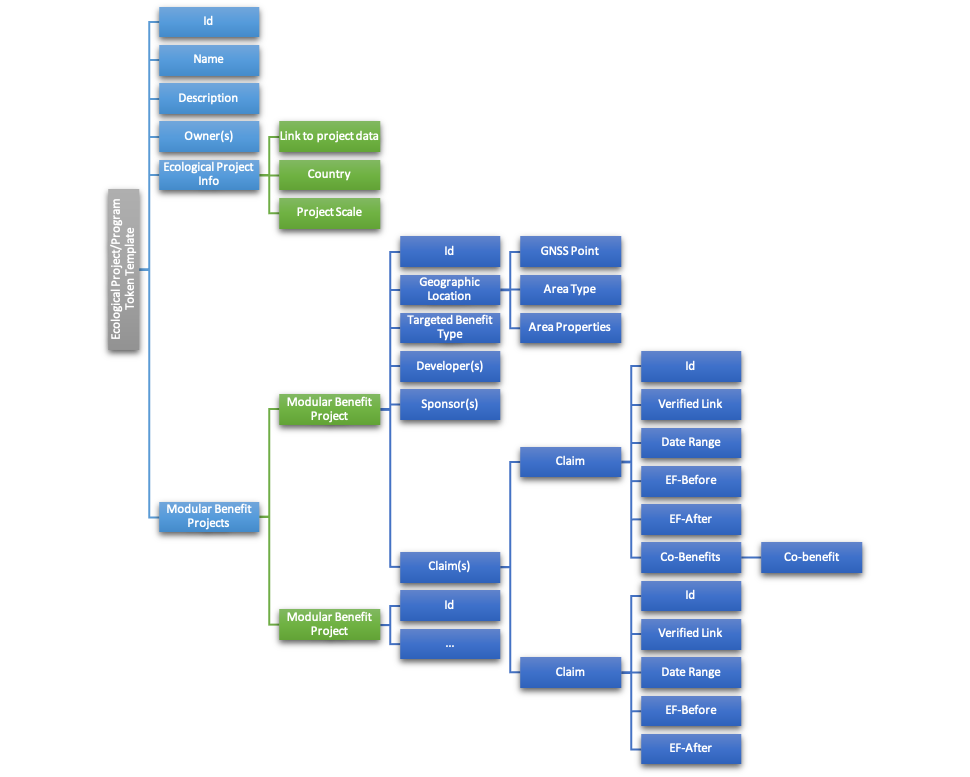
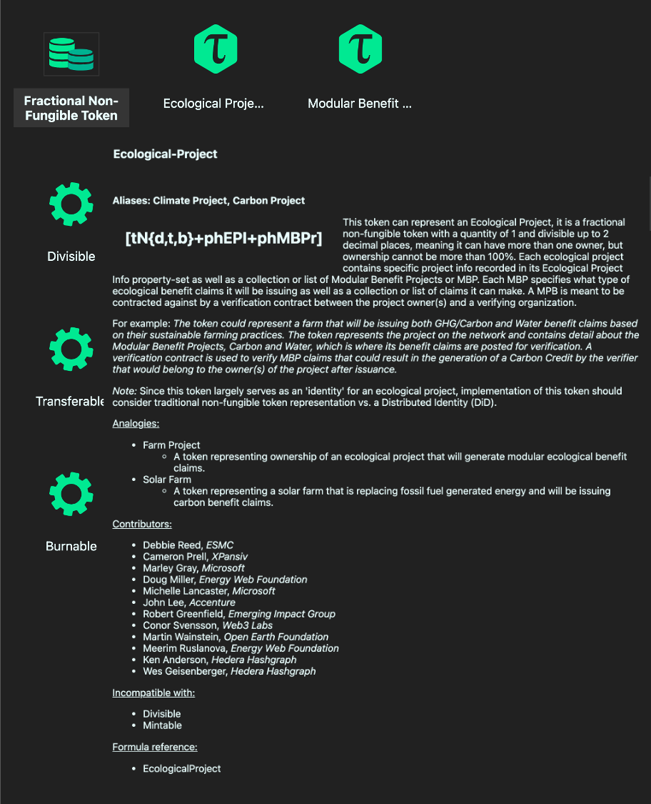
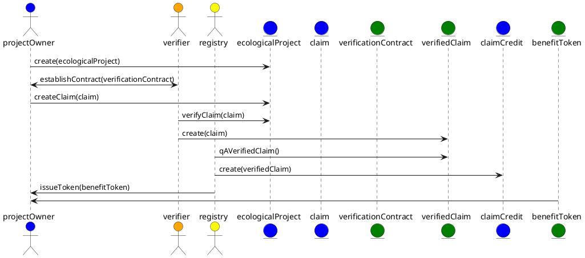
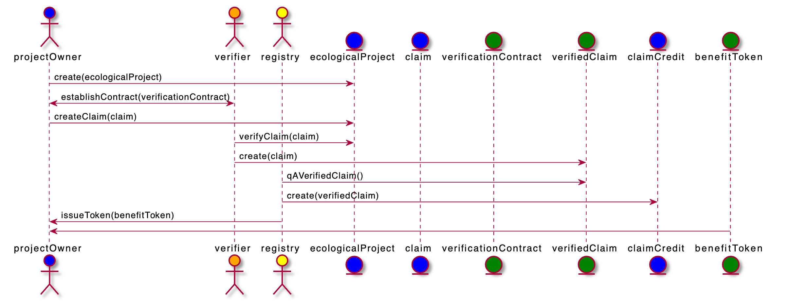

# Ecological Project or Program (EP)

Ecological Projects or Programs provide a single source of truth to all participants regarding the identity of a project or program and its ecological benefit claims. It is important to have this source of truth for all participants to be able to trace the ecological benefit token back to its project. Key details that are important for the supplier, verifier, registry and buyer in the market are recorded in the Ecological Project or Program object.

What is the difference between a Project and a Program?

- A **Project** is typically used to describe nature-based projects like agricultural (farms) or forestry.
- A **Program** is typically used to describe a technology-based solution like direct air capture or carbon capture during natural gas extraction or processing.

Every Ecological Project or Program will have the following:

- Unique identifier ("Id"): An identifier that is issued and independent of the "name" of the project. The Id is used to reference the project and link it to its claims, verification, and credits issued to it.
- Name: A name is recommended, but not required, to be unique.
- Description: A brief description of the project.
- Owner(s): One or more references to the Id(s) of the project or program owner(s).
- Ecological Project Info: Metadata, defined below, about the project.
- Modular Benefit Projects ("MBP"): A project has one or more MBPs based on the type of claim that the project will be making. For example, a project can make both carbon reduction and removal claims and would need a MBP for each type of claim it will make.

Ecological Project Info contains:

- Link to Project Data: A verified link to more project data like marketing materials or a website.
- Country: The host country for the project.
- Project Scale: One from the list of - Micro, Small, Medium or Large

Modular Benefit Project contains:

- Unique identifier ("Id"): An identifier that is issued and independent of the the project. The Id is used to establish a compound identifier linking the MBP with its host EP.
- Geographic Location:
  - Basic GNS/GPS for Programs
  - GeoJSON for Projects
- Targeted Benefit Type:
  - Carbon: Reduction/Removal + Natural/Technology
  - Water:
  - Nitrogen:
- Developer(s)
- Sponsor(s)
- Claims

Claim contains:

- Unique identifier (Id): An identifier that is issued and independent of the the MBP. The Id is used to establish a compound identifier linking the claim with its MBP and EP.
- Verified Link: Is a reference to the source data the claim is based on. This contains a [URI](https://en.wikipedia.org/wiki/Uniform_Resource_Identifier) pointing to the data file which can be verified. The data file should be accompanied by either a signature or a hash so that the integrity can be verified. For example, this can be accomplished using the [W3C DID specification](https://www.w3.org/TR/did-core/).
- Date Range: The date span for which the claim is being made.
- Environmental Effects Before: A measure of the claim before project activities.
- Environmental Effects After: A measure of the claim after project activities.
- Co-benefits: One or more options from a list of the added benefits we get above and beyond the direct benefits of a more stable climate.

**The complete draft of the TTF specification, including its token base and behaviors, for the [Ecological Project](https://github.com/InterWorkAlliance/TTF/tree/master/artifacts/token-templates/specifications/Ecological-Project/latest).**

## Basic flow for establishing a project and issuing offsets

Here are the high-level, "greenfield", steps for establishing an ecological project and having [CCPs](ccp.md) issued for it.

- An ecological project owner defines their project and determines the type of benefit claims that they will be making. Claims should be based off of a scientific standard established by a registry that matches the activity the project will be conducting.
- The project owner will need to contract with a certified verifier of the standard for which they are submitting claims. Once contracted, the project owner can submit the claim, which is comprised of the data required by the standard for the time period of the claim and a  receipt, which is the entry in the Modular Benefit Project.
- The contracted verifier verifies the claim against the associated registry standard. The amount of the claim, a carbon reduction or removal, becomes the verified claim which consists of the marked up claim data and verification report. This includes a receipt for the verified claim that is the entry on the verification contract.
- A verified claim is then picked up by the registry of the standard used for the claim. After a quality check, the registry creates a credit in the amount verified by the claim. This becomes the carbon credit. Once the credit is established in the registry, the credit is "tokenized" in an intangible reference token. This is generically referred to as an Ecological Benefit Token, but is tokenized as a specific type, like a Core Carbon Principles token. On the registry and ledger where the token is implemented, the owner of the credit is the ecological project owner.

