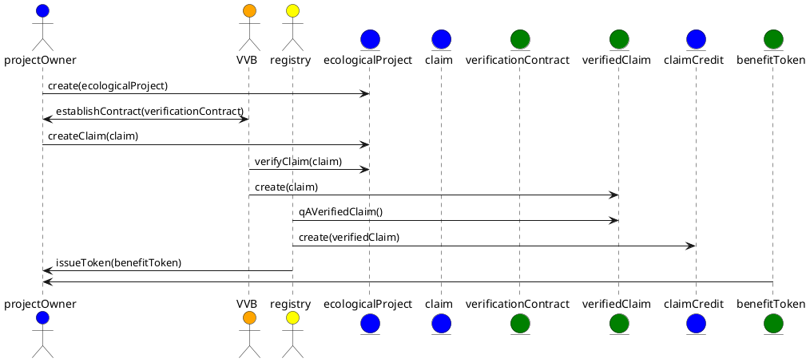

# Ecological Project or Program (EP)

Ecological Projects or Programs provide a single source of truth to all participants regarding the identity of a project or program and its ecological benefit claims. It is important to have this source of truth for all participants to be able to trace the ecological benefit token back to its project. Key details that are important for the supplier, validation and verification body ("VVB"), registry and buyer in the market are recorded in the Ecological Project or Program object.

What is the difference between a Project and a Program?

- A **Project** is typically used to describe nature-based projects like agricultural (farms) or forestry.
- A **Program** is typically used to describe a technology-based solution like direct air capture or carbon capture during natural gas extraction or processing.

Every Ecological Project or Program will have the following:

- Unique identifier ("Id"): An identifier that is issued and independent of the "name" of the project. The Id is used to reference the project and link it to its claims, verification, and credits issued to it.
- Name: A name is recommended, but not required, to be unique.
- Description: A brief description of the project.
- Owner(s): One or more references to the Id(s) of the project or program owner(s).
- Ecological Project Info: Metadata, defined below, about the project.
- Modular Benefit Projects ("MBP"): A project has one or more MBPs based on the type of claim that the project will be making. For example, a project can make both carbon reduction and removal claims and would need a MBP for each type of claim it will make.

Ecological Project Info contains:

- Link to Project Data: A verified link to more project data like marketing materials or a website.
- Country: The host country for the project.
- Project Scale: One from the list of - Micro, Small, Medium or Large

Modular Benefit Project contains:

- Unique identifier ("Id"): An identifier that is issued and independent of the the project. The Id is used to establish a compound identifier linking the MBP with its host EP.
- Geographic Location:
  - Basic GNS/GPS for Programs
  - GeoJSON for Projects
- Targeted Benefit Type:
  - Carbon: Reduction/Removal + Natural/Technology
  - Water:
  - Nitrogen:
- Developer(s)
- Sponsor(s)
- Claims

Claim contains:

- Unique identifier (Id): An identifier that is issued and independent of the the MBP. The Id is used to establish a compound identifier linking the claim with its MBP and EP.
- Verified Link: Is a reference to the source data the claim is based on. This contains a [URI](https://en.wikipedia.org/wiki/Uniform_Resource_Identifier) pointing to the data file which can be verified. The data file should be accompanied by either a signature or a hash so that the integrity can be verified. For example, this can be accomplished using the [W3C DID specification](https://www.w3.org/TR/did-core/).
- Date Range: The date span for which the claim is being made.
- Environmental Effects Before: A measure of the claim before project activities.
- Environmental Effects After: A measure of the claim after project activities.
- Co-benefits: One or more options from a list of the added benefits we get above and beyond the direct benefits of a more stable climate.

**The complete draft of the TTF specification, including its token base and behaviors, for the [Ecological Project](https://github.com/InterWorkAlliance/TTF/tree/master/artifacts/token-templates/specifications/Ecological-Project/latest).**

## Basic flow for establishing a project and issuing offsets

Here are the high-level, "greenfield", steps for establishing an ecological project and having [CCPs](ccp.md) issued for it.

- An ecological project owner defines their ecological project and determines the type of environmental benefits it seeks to achieve and associated claims.  Such benefits will be measured by and/or against and based on a Quality Standard established by a credible standards body that matches and maps to the activity the EP will be implementing/conducting.
- The project owner will register with the applicable Standards Body and Issuing Registry and obtain all necessary authorizations in accordance with the rules and requirements of each.
- The project owner may contract with a certified VVB authorized by the standards body to verify the EP data against the Quality Standard for which they are registering, including an Ecological Claim token. Once contracted, the project owner can submit the necessary materials for a claim token, which consists of the data required (evidence) by the Quality Standard for the period of the claim. The claim token will be linked to the submitted EP and the applicable Modular Benefit Project, with references to its raw data and any reference claim data.
- The contracted VVB will validate and verify the registered claim by encumbering the claim token and then processing it against the associated Quality Standard. Once completed, a Processed Claim token is created and the claim that was verified is marked as processed/retired with the link to the Processed Claim token. The processed claim contains the amount of the claim, a carbon reduction or removal, which consists of the marked-up claim data and verification report.
- A processed claim is then picked up by the authorized issuing registry for the applicable Quality Standard. After optional additional checks (KYC, quality, etc.), the registry creates a credit in the amount verified by the processed claim. The issuing registry may choose to maintain the native credit on their own system and issue a reference token on a DLT or other system for distribution.
- This is generically referred to as an Ecological Benefit Token but is tokenized as a specific type of token based on the Quality Standard and EP type. On the registry and ledger where the token is implemented, the owner of the credit is the ecological project owner. The Processed Claim token is then credited/retired along with the Id for the credit issued against the claim, preventing the processed claim from being credited more than once.

