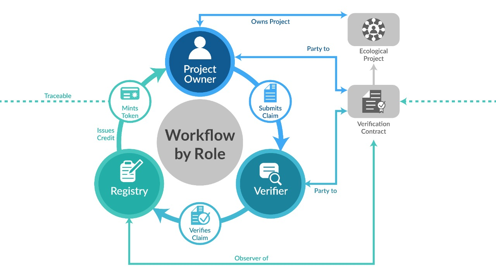

# Validation and Verification Contract

A Validation and Verification Contract is a multiparty contract between an Ecological Project owner and a VVB of the type of benefit claims that the project will be creating. Because benefit claims should map to a scientific standard developed by a registry, the VVB must be certified to perform the verification by the registry.

## Key Points

There are a few key points between the parties involved in the verification process:

- Each Ecological Project (EP) can have multiple Modular Benefit Projects (MBP), where each MBP creates claims based on a selected standard. Only one MBP can create claims of a specific type per EP. For example: an Ecological Project can have a MBP for Carbon Reductions and another for Carbon Removals.
- The Verification Contract is established at the MBP level as it is the source of claims to be verified.
- There can be different VVBs for MBPs in a given EP.
- EPs can switch VVBs between claims from its MBP.
- MBP Claims are based on the selected standard from a registry, thus the registry is an observer or non-active party in the verification process. *There are standards where the verification and registry roles are combined where this would be collapsed into a single role.*

## Properties

Each Verification Contract contains the following:

- Unique identifier (Id): that is issued and independent of the "name" of the contract. The Id is used to reference the contract and link it to its verified claims and credits issued from it.
- Name: A name, recommended, but not required, to be unique.
- Description: a brief description of the contract.
- Signatories: have Id(s) of the EP owner and VVB.
- Verification Standard:
  - Protocol
  - Version
  - Verified Link: link to the published standard
- MRV Requirements (Measurement, Reporting and Verification)
  - Measurement Specification
  - Verified Link: link to the detailed measurement spec
- Agreement Date
- Estimated Annual Credits
- Reference to Ecological Project/MBP
- Processed Claims:
  - Verified Claim
    - Id: unique, independent Id for the verified claim.
    - Claim Id: reference to the source claim.
    - Verified Link: link to the verification data.

## IWF

The IWA Interwork Framework (IWF) where the Verification Contract specification will be generated, however it is currently under development [here](https://github.com/InterWorkAlliance/IWF).
