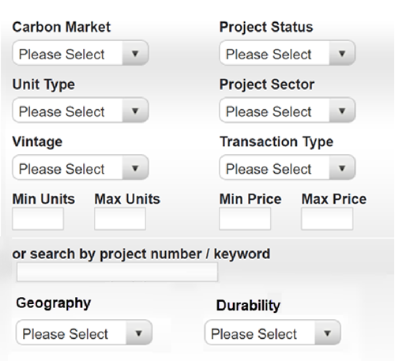

# Lifecycle - Buying and Trading Contracts

This section covers contracts that span across emissions and credits like a Delivery vs. Payment contract for trading offsets for another established value (money). The VEM will align with the recommendations issued by the [TSVCM](https://www.iif.com/tsvcm) operating committee to shape the drafts for each of the below contract types.

## Standard Reference Contracts

Due to the wide range of the underlying tokens these contracts have to be support both
deliverable and cash-settled trades.
The underlyings can be fungible or non-fungible, but the distinction may impact the legal analysis if the contract is
a security, commodity, or hybrid.

The three simplest classes of contracts are:
-	Spot – standard "immediate settlement" for a market. Often T+2 but market conventions vary from minutes to T+3 or further.
-	Forward – contracts between two parties for delivery/settlement at a date (or time) other than Spot.
-	Futures – derivative financial instruments that derive their value from the underlying asset. Typically exchange boilerplate listed contracts traded for up to 24 months (most futures exchanges are in North America, UK, Asia)

 
## Buyer Preference for Offsets

Buyers in a voluntary marketplace can send a demand signal through their [ESG Scorecard](../demand/ESG-Scorecard.md), but will also need to be able to search for and trade credits based on their properties. Buyer preference can be based on a classification filter, e.g. 
  - reduction vs. removal
  - natural vs. technology
  - co-benefits types
  - source geography
  - Vintage
  - Durability
  - Methodology
  - etc
  
However, through the derivatives instruments (spot/forwards/futures), there would be a readily available market to bring the sellers and buyers of the offers together.

## Voluntary Buyer Use Cases

As a voluntary market can offer both standardized carbon credits like a commodity, a.k.a. a standard reference contract that is fungible with other credits in the same class or can be non-fungible custom contracts that can differ in value and also be bundled together based on their Core Carbon Attributes, an implementation should have searchable parameters.

Using the specifications for [Ecological Projects](../supply/ep.md), [Core Carbon Principle Credits](../supply/ccp.md) and [Verification Contracts](../supply/verification.md), buyers should be able build queries to find products based on their buyer preferences.

